<h3>
<code>vadim@github:~$ whoami</code>
</h3>

 

<table>
<tr>

<td width="430" valign="top">

</td>

<td width="490" valign="top">

</td>

</tr>
</table>

 

<code>Frontend Developer · React · TypeScript · JavaScript</code>

